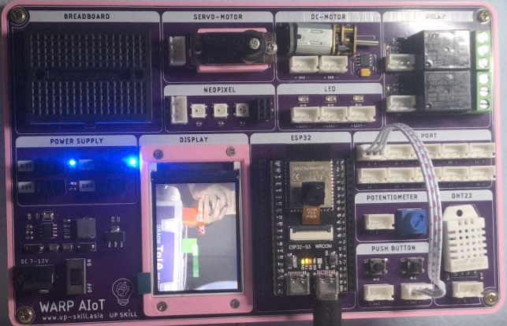

# FOMO-object-detect-TFT-Esp32
This project was intended for displaying camera feed and inference results of [FOMO object detection model](https://edge-impulse.gitbook.io/docs/edge-impulse-studio/learning-blocks/object-detection/fomo-object-detection-for-constrained-devices) by [Edge Impulse](https://edgeimpulse.com/) to TFT screen. The Hardware were provided by [Wireless Solution Asia](https://wirelesssolution.asia/). To run this project users must obtain a model from Edge Impulse. 
   
<strong> - I've created repository to provide simple guide to traning your model please visit [train-FOMO-object-detect-esp32](https://github.com/San279/train-FOMO-object-detect-esp32). </strong>  
<strong>- Please refer to this [repository](https://github.com/San279/Esp32-camera-to-tft) to set up TFT and Camera before running this project. </strong>
   

    
## What you'll need
- [Arduino IDE](https://www.arduino.cc/en/software), preferably the latest ones, but older versions will still do the job.
- ESP32-S3 is preferable but older version will do just fine.
- ST7789 or any TFT screens.
- OV2640 camera or any OV series.

## Project files descriptions
1. FOMO_object_detect_TFT.ino - Containes Arduino codes displaying camera feed and FOMO results to TFT screens.

## How to install and run the project
1. Download the zip file and extract it to Arduino directory.   

    
2. Open Fomo_object_detect_TFT.ino, under tools change your Board to "ESP32S3 Dev Module" and PSRAM to "OPI PSRAM".   

    
3. Add the zip folder of the trained model obtained from Edge Impulse to Arduino IDE. </strong>   

  

    
4. Connect pin no.1 of the Esp32 to a push button.   
- if you're using [AIOT board](https://wirelesssolution.asia/), simply connect I/O port 1 to any push button.
  
  
- if you do not have AIOT board, connect I/O pin 1 of the Esp32 to one of the leg of a push button and other leg to 3v.  

    
5. Upload the code to Esp32-S3. This process might take up to 30 minutes, and you're Done!!   

    

## Project features
- User can change resolution of the camera when the push button is pressed. The avaiable resolution is as follow.   
- 96 X 96   

   
- QQVGA 160 X 120    

   
- 176 X 144    

   
- 240 X 176    

   
- 240 X 240    

   
- 320 X 240    

   

## Credit
Thanks to [WIRELESS SOLUTION ASIA CO.,LTD](https://wirelesssolution.asia/) for providing AIOT board to support this project. Also thanks to [Bodmer / TFT_eSPI](https://github.com/Bodmer/TFT_eSPI/blob/master/README.md) for the TFT libraries. Scripted used for Esp32 FOMO object detection inferencing were provided by [Edge Impulse](https://edge-impulse.gitbook.io/docs/edge-impulse-studio/learning-blocks/object-detection/fomo-object-detection-for-constrained-devices). 
